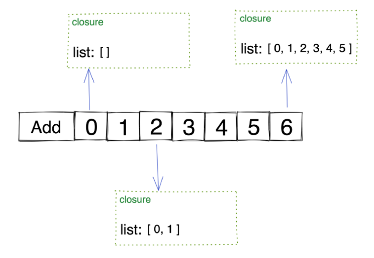

# A React Hooks Challenge

- Closure problem with hooks
- The principle of state

## Contenido

Tenemos un componente que contiene un botón y una lista.

```jsx
<div className="App">
  <button onClick={add}>Add</button>
  {list.map(val => val)}
</div>
```

La parte divertida y compleja es que cuando haces clic en el botón **Add**, se agregará un nuevo botón a la lista que también tiene un evento onClick={add}.

```jsx
const add = () => {
    setList(
      list.concat(
        <button 
          key={i} 
          onClick={add}>
          {i++}
        </button>
      )
    );
  };
```

## Reto

Aquí hay una pregunta: si hacemos clic en estos números, ¿qué sucederá?, ¿cómo se verá la lista? si:

- Si hacemos clic en el botón 0
- Si hacemos clic en el botón 6

## Respuesta

Uno podría estar tentado a pensar que se insertará un nuevo botón en la lista después de hacer clic en un número.

Pero eso seria incorrecto. La realidad es que cuando hacemos clic en uno de los botones con número, la longitud de la lista se convertirá en **[el numero + 1]**, y el último número de la lista se convertirá en **[el ultimo numero antes del click + 1]**.

Esta declaración parece un poco complicada, pero veamos unos ejemplos:

- Si hacemos clic en el botón 0, la longitud de la lista cambiará a **0 + 1 = 1**, y el último número se convertirá en **6 + 1 = 7**.
- Si hacemos clic en el botón 2, la longitud de la lista cambiará a **2 + 1 = 3**, y el último número se convertirá en **6 + 1 = 7**.

### ¿Por qué se produce este fenómeno?

## State and Closure

Esto ocurre por dos factores trabajando en conjunto:

- El problema de los closure con los hooks
- Cómo se ensambla el estado del componente

Cuando se hace click en el botón la función add es llamada y entonces el closure es creado basado en su contexto.

El closure contiene:

- La función add
- list
- setList

donde list y setList fueron creados por el hook useState.

Aquí hay un malentendido común: El list devuelto por varias llamadas a useState es el mismo objeto con la misma dirección en la memoria.
De hecho, el list devuelto por cada llamada a useState se calcula en base a la siguiente fórmula:

```js
estado base + actualización1 + actualización2 + … = estado actual
```

> Nota de un colaborador de React: El estado en React se calcula en base a **baseState** un enlace de la actualización. Se puede buscar una función de nombre **processUpdateQueue** en el código fuente de React, ahí es donde se ejecuta el cálculo.

Entonces, los list devueltos por múltiples llamadas useState son diferentes objetos con diferentes direcciones en la memoria.

Esto lleva a un fenómeno muy importante: las funciones add correspondientes a cada número están en closure diferentes y list tiene valores diferentes.



Ahora, **i** es una variable a nivel de módulo; son los mismos en cada cierre.

Al hacer clic en 0, ocurre lo siguiente:

- **i** es una variable a nivel de módulo, 6
- list en este closure es []

Así que en realidad ejecuta lo siguiente:

```jsx
setList( 
  [].concat( 
    <button key={7} onClick={add}>{7}</button> 
  ) 
);
```

Entonces la lista en la página web se convierte en [7].

Cuando haces clic 2, sucede esto:

- **i** es una variable a nivel de módulo, 6
- list en este closure es [0, 1]

Así que en realidad ejecuta esto:

```jsx
setList( 
  [0, 1].concat( 
    <tecla de botón={7} onClick={add}>{7}</button> 
  ) 
);
```

Y la lista en la página web se convierte en [0, 1, 7]

y asi sucesivamente...

## Conclusión

Dado que el principio de asamblea del estado es:

```js
estado base + actualización1 + actualización2 + … = estado actual
```

Entonces, cada vez que useState se llama, sus valores de retorno son objetos diferentes.
Debido al closure, en list se registran diferentes valores en cada botón con valor numérico.
Esto finalmente conduce al fenómeno descrito al principio.

## Solución

Si no se desea este fenómeno de closure se puede modificar el parámetro setList.

```jsx
// before
setList(list.concat(<button key={i} onClick={add}>{i++}</button>));


// after
setList(list => list.concat(<button key={i} onClick={add}>{i++}</button>));
```
